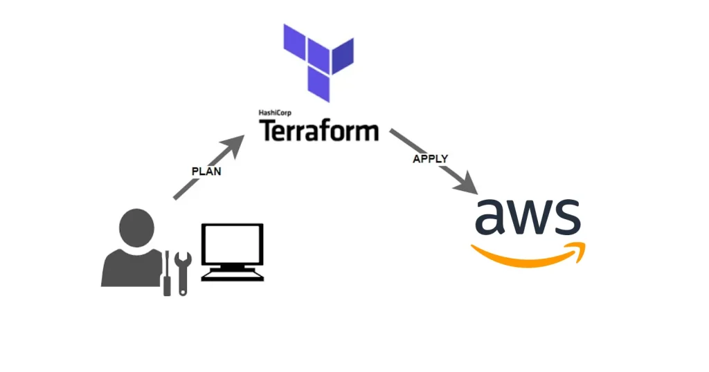

# Terraform & Terr️Terragrunt Hands-On Labs 🚀

This repository contains a **comprehensive, hands-on Terraform & Terragrunt learning series**, designed to build a **solid Infrastructure as Code (IaC) foundation** with real-world AWS use cases.

The content follows a **progressive learning path** — from Terraform basics to advanced topics such as **remote backends, modules, workspaces, publishing modules, and Terragrunt orchestration**.

> 🎯 **Goal:** Learn Terraform & Terragrunt the way they are used in real DevOps / Cloud environments — modular, scalable, and production-ready.

---

## 🧭 Learning Path Overview

The repository is structured into **incremental hands-on folders**, each focusing on a specific Terraform or Terragrunt concept.

```text
├── terraform-01_Installation_Basic_Operations
├── terraform-02_Terraform_Commands_Variables_Conditionals_Loops
├── terraform-03_Data_Sources_Remote_Backend_Provisioners
├── terraform-04_Modules_Import
├── terraform-05_Publish_Modules_Terraform_Workspaces
└── terragrunt_Basic_operations
```

Each folder is **self-contained**, includes step-by-step instructions, and can be executed independently.

---

## 📦 Hands-On Modules Breakdown

### 1️⃣ Terraform Installation & Basic Operations

📁 `terraform-01_Installation_Basic_Operations`

**Focus:**

- Terraform installation (Amazon Linux)
- Basic Terraform workflow
- `init`, `plan`, `apply`, `destroy`
- Understanding `.tfstate` and lifecycle basics

**Key Concepts:**

- Providers
- Resources
- State file fundamentals
- First EC2 provisioning

---

### 2️⃣ Terraform Commands, Variables, Conditionals & Loops

📁 `terraform-02_Terraform_Commands_Variables_Conditionals_Loops`

**Focus:**

- Terraform CLI commands
- Variables & locals
- Outputs
- `count`, `for_each`
- Conditional expressions
- `.tfvars` usage

**Key Concepts:**

- Parameterized infrastructure
- Reusable configurations
- Dynamic resource creation

---

### 3️⃣ Data Sources, Remote Backend & Provisioners

📁 `terraform-03_Data_Sources_Remote_Backend_Provisioners`

**Focus:**

- Terraform data sources
- AMI lookups
- Remote state with S3
- State locking & versioning
- Provisioners (`local-exec`, `remote-exec`, `file`)

**Key Concepts:**

- Remote state management
- Team-safe Terraform usage
- Bootstrapping EC2 instances

---

### 4️⃣ Terraform Modules & Import

📁 `terraform-04_Modules_Import`

**Focus:**

- Root vs child modules
- Module inputs & outputs
- Environment separation (dev / prod)
- Importing existing AWS resources
- `terraform import` & import blocks

**Key Concepts:**

- Modular IaC design
- DRY principle
- Managing legacy infrastructure

---

### 5️⃣ Publishing Modules & Terraform Workspaces

📁 `terraform-05_Publish_Modules_Terraform_Workspaces`

**Focus:**

- Creating reusable Terraform modules
- Publishing modules to Terraform Registry
- Semantic versioning
- Terraform workspaces (`dev`, `stage`, `prod`)
- Workspace-based configurations

**Key Concepts:**

- Public module publishing
- Multi-environment management
- Clean state separation

---

### 6️⃣ Terragrunt – Basic Operations

📁 `terragrunt_Basic_operations`

**Focus:**

- Terragrunt installation
- DRY Terraform with Terragrunt
- Multi-environment orchestration
- `run-all apply` / `run-all destroy`
- Centralized configuration

**Key Concepts:**

- Terragrunt as a Terraform wrapper
- Environment orchestration
- Scalable IaC layouts

---

## ☁️ Technologies Used

- **Terraform**
- **Terragrunt**
- **AWS (EC2, VPC, S3, IAM)**
- **Amazon Linux 2023**
- **Git & GitHub**

---

## 🛠 Prerequisites

- AWS Account
- AWS CLI configured
- Basic Linux knowledge
- SSH key pair
- Terraform & Terragrunt installed (or provisioned via userdata)

---

## 🎯 Who Is This For?

- DevOps Engineers
- Cloud Engineers
- Infrastructure Engineers
- Backend / Full-Stack Developers moving into DevOps
- Anyone learning **Infrastructure as Code seriously**

---

## 🧠 Key Takeaways

✔ Real-world Terraform usage  
✔ Clean folder & module structure  
✔ Production-ready practices  
✔ DRY & scalable IaC design  
✔ Terraform + Terragrunt mastery

---

## 📌 Notes

- These labs are **for learning and demonstration purposes**
- Not intended for direct production use without adaptation
- Always review IAM permissions and costs in AWS

---

## 🤝 Author

**Ogulcan (Ogi)**  
Cloud / DevOps focused engineer  
Hands-on driven • IaC enthusiast • AWS & Terraform practitioner

---

🔥 _If you understand and can apply everything in this repository, you have a solid, real-world Terraform & Terragrunt skill set._
